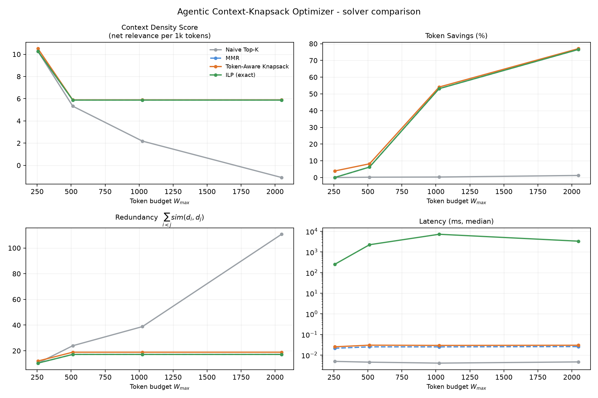

# Agentic Context-Knapsack Optimizer

**Token-aware context packing for agentic search, framed as a Quadratic Knapsack Problem.**

---

## Abstract

Agentic search systems retrieve documents and then paste the top-`k` into an LLM
context window. Ranking by relevance alone is the wrong objective for that second
step: it optimizes *per-document* utility under no constraint, while the real
system has a hard token budget `W_max` and a set-level utility. Three failures
follow. **Redundancy** — top-ranked passages paraphrase one another, so the second
copy of a fact costs tokens and adds nothing. **Token inefficiency** — a 200-token
padded passage and a 15-token snippet carrying the same claim are ranked by the
same score, and the long one crowds out a dozen short ones. **Lost-in-the-middle** —
the resulting bloated prompt raises latency, cost, and the rate at which the model
ignores facts buried mid-context.

This repository treats context selection as constrained subset selection rather
than ranking. Relevance is summed over the chosen set, pairwise similarity is
penalized, token cost is a hard constraint, and the resulting Quadratic Knapsack
Problem is solved three ways: a naive Top-K baseline, a token-aware greedy
heuristic, and an exact ILP that provides ground truth. On a seeded 25-document
benchmark the token-aware greedy reaches **98.1% of the proven ILP optimum in
0.03 ms**, against **2.3-7.4 s** for the exact solver, while leaving **77% of a
2048-token budget unspent** where Top-K leaves 1.2% and scores *negative* net
utility.

Everything runs locally on CPU with open models (`all-MiniLM-L6-v2`,
`tiktoken`, `PuLP`/CBC). No paid API is used anywhere in the framework or the
benchmark.

---

## 1. Problem Formulation

Let `D = {d_1, ..., d_N}` be the candidate documents returned by a retriever for
query `q`, with

- relevance `r_i = rel(q, d_i) = cos(e_q, e_i) ∈ [-1, 1]`
- pairwise similarity `s_ij = sim(d_i, d_j) = cos(e_i, e_j)`, clipped to `[0, 1]`
- token cost `w_i = |tokenize(d_i)|` under `cl100k_base`

Select `S ⊆ D` maximizing

```
                                   ┌
maximize   Score(S) = Σ  rel(q, d_i)  -  λ  Σ     sim(d_i, d_j)
   S                 i∈S                  i<j∈S

subject to            Σ  w_i  ≤  W_max ,        λ ≥ 0
                     i∈S
```

In LaTeX:

$$
\max_{S \subseteq D} \; \sum_{i \in S} rel(q, d_i) \;-\; \lambda \sum_{i < j \in S} sim(d_i, d_j)
\qquad \text{s.t.} \qquad \sum_{i \in S} w_i \le W_{max}
$$

This is the **Quadratic Knapsack Problem** (QKP), NP-hard: a linear knapsack
whose objective carries a negative pairwise interaction term. Setting `λ = 0`
recovers the linear knapsack; setting all `w_i` equal and `λ > 0` recovers
Maximal Marginal Relevance.

### ILP linearization (exact solver)

Binary `x_i` selects document `i`; `y_ij` linearizes the product `x_i x_j`:

$$
\max \;\sum_i r_i x_i - \lambda \sum_{i<j} s_{ij} y_{ij}
\quad \text{s.t.} \quad
\sum_i w_i x_i \le W_{max}, \quad
y_{ij} \ge x_i + x_j - 1, \quad
x_i \in \{0,1\}, \; y_{ij} \ge 0
$$

Every `y_ij` carries a non-positive objective coefficient, so the solver always
drives it to its lower bound. Two consequences exploited in `optimizer.py`:
`y` can stay **continuous** (no branching on `O(N²)` variables), and the usual
`y_ij ≤ x_i`, `y_ij ≤ x_j` constraints are **redundant**. Pairs with `s_ij = 0`
are dropped from the model entirely.

### Token-aware greedy (the proposed heuristic)

At each step, pick the feasible document maximizing marginal gain **per token**:

$$
i^{*} = \arg\max_{i \notin S} \; \frac{rel(q, d_i) - \lambda \sum_{j \in S} sim(d_i, d_j)}{w_i}
$$

Classic MMR uses the same numerator but ignores `w_i`, which is exactly why it
buys long padded passages. The running penalty `Σ_{j∈S} sim(i, j)` is maintained
as one vectorized array update per iteration, so the loop is `O(N·|S|)` with no
per-vector Python arithmetic. Selection stops when the budget admits no candidate
or when the best marginal gain turns non-positive — spending tokens past that
point strictly lowers `Score(S)`.

---

## 2. Experimental Setup

| Component | Choice |
|---|---|
| Encoder | `all-MiniLM-L6-v2` (sentence-transformers, CPU) |
| Tokenizer | `tiktoken`, `cl100k_base` |
| Exact solver | `PuLP` + CBC, no time-limit hit (optimality proven) |
| Corpus | 25 synthetic documents, seed `42` |
| Query | *"How does attention-based retrieval fit inside a limited LLM context window?"* |
| Token stats | min 12, median 77, max 205, mean 84 |
| `λ` | 0.1 (see Finding 2) |
| Latency | median of 3 runs, solver time only (encoding excluded) |

The corpus is generated by `generate_corpus()` with controlled pathologies:
~45% concise on-topic sentences drawn from a small fact bank (redundancy), ~30%
of those same facts padded 2-6x with filler (token inefficiency), ~15%
multi-fact dense passages, ~10% off-topic distractors.

**Metrics.** *Latency (ms)* is wall-clock solve time. *Context Density Score* is
net objective per 1,000 tokens spent, `1000 · Score(S) / Σ w_i`. *Token Saved (%)*
is the share of `W_max` left unspent. *Coverage* is the fraction of distinct
information clusters (greedy clustering at `sim ≥ 0.85`) touched by the selection —
it is the guard that keeps token savings honest.

---

## 3. Key Findings

### Finding 1 — The similarity baseline among retrieved documents is high, not near zero

Measured on the benchmark corpus with `all-MiniLM-L6-v2`:

| Pair population | Mean cosine | Median | Max |
|---|---|---|---|
| On-topic vs. off-topic chatter | 0.030 | 0.000 | 0.162 |
| **Within on-topic facts** | **0.252** | — | — |
| All pairs in the retrieved corpus | 0.405 | 0.329 | 1.000 |

Unrelated text is genuinely near-orthogonal (0.03). The consequential number is
the **0.25 mean similarity among the documents that survive retrieval** — by
construction they are all on-topic, so the redundancy term is never small in
practice. Meanwhile `rel(q, d)` tops out at **0.525** (mean 0.363): similarity
between candidates is of the same order as their relevance to the query. Any
formulation that sums both must account for that scale mismatch.

### Finding 2 — λ must be tuned against the `O(|S|²)` / `O(|S|)` asymmetry

Relevance accumulates linearly in `|S|`; the penalty accumulates over pairs. With
mean relevance 0.36 and mean pairwise similarity 0.25, a 10-document selection has

```
relevance  ≈ 10 · 0.36        =  3.6
redundancy ≈ C(10,2) · 0.25   = 11.3      →  λ · 11.3 exceeds 3.6 at λ ≈ 0.32
```

Above that point every additional document is net-negative and the solvers stop
early regardless of the budget. Empirically (`W_max = 1024`, N = 50):

| λ | docs selected | token saved | coverage | behaviour |
|---|---|---|---|---|
| 0.05 | 23 | 15.9% | 0.53 | penalty too weak — near Top-K |
| **0.10** | **13** | **72.1%** | **0.27** | **balanced** |
| 0.15 | 9 | 79.7% | 0.23 | aggressive |
| 0.30 | 5 | 93.8% | 0.17 | collapse — budget unusable |

The default was moved from the conventional `λ = 0.5` (inherited from MMR, where
the penalty is a **max**, not a **sum**) to `λ = 0.1`. Using MMR's constant with a
summed penalty is a scale error, not a preference.

### Finding 3 — Token-aware greedy buys 98.1% of the optimum for 1/75,000 of the cost

| | Token-Aware Greedy | ILP (exact) |
|---|---|---|
| Objective reached | **98.1-98.4% of optimum** | 100% (proven) |
| Latency | **0.03 ms** | 721 - 7,356 ms |
| Scaling | `O(N·\|S\|)` | `O(N²)` binaries + branch & bound |

The gap is consistently ≤ 1.9% across every budget tested, and the greedy
selection is never dominated: at `W_max = 512` it returns 11 documents against the
ILP's 10, with **higher coverage (0.56 vs 0.50)** at 1.9% lower objective — it
trades a sliver of the quadratic objective for one extra information cluster.
At `N = 50` the exact solver stops proving optimality within 300 s, which is the
practical argument for the heuristic: the ILP is a validation instrument, not a
serving-path component.

**The Top-K baseline degrades as the budget grows.** This is the headline failure
mode: give a relevance ranker more room and it spends it on near-duplicates. At
`W_max = 2048` its objective goes **negative** (-2.217), redundancy reaching 110.7
against the greedy's 18.9 — a 5.9x reduction in wasted context.

---

## 4. Results

Seed 42, N = 25, λ = 0.1, `all-MiniLM-L6-v2`, `cl100k_base`. ILP proven optimal at
every budget. Latency is the median of 3 runs; selections and objectives are
deterministic, CBC wall-clock varies a few percent between runs.
`vs ILP` is `Score(S) / Score(S*)`.

| `W_max` | Method | Latency (ms) | Context Density | Token Saved (%) | Score | Redundancy | Coverage | Docs | vs ILP |
|---:|---|---:|---:|---:|---:|---:|---:|---:|---:|
| **256** | Naive Top-K | 0.01 | 10.259 | 0.0 | 2.626 | 10.39 | 0.44 | 8 | 1.000 |
| | MMR | 0.02 | 10.259 | 0.0 | 2.626 | 10.39 | 0.44 | 8 | 1.000 |
| | **Token-Aware Knapsack** | **0.03** | **10.505** | **3.9** | 2.584 | 12.02 | **0.50** | 9 | 0.984 |
| | ILP (exact) | 721.40 | 10.259 | 0.0 | **2.626** | 10.39 | 0.44 | 8 | 1.000 |
| **512** | Naive Top-K | 0.00 | 5.327 | 0.2 | 2.722 | 23.93 | 0.62 | 12 | 0.965 |
| | MMR | 0.03 | 5.876 | 6.2 | 2.821 | 17.16 | 0.50 | 10 | 1.000 |
| | **Token-Aware Knapsack** | **0.03** | **5.888** | **8.2** | 2.768 | 18.90 | **0.56** | 11 | 0.981 |
| | ILP (exact) | 2257.55 | 5.876 | 6.2 | **2.821** | 17.16 | 0.50 | 10 | 1.000 |
| **1024** | Naive Top-K | 0.00 | 2.183 | 0.3 | 2.229 | 38.79 | 0.62 | 14 | 0.790 |
| | MMR | 0.03 | 5.876 | 53.1 | 2.821 | 17.16 | 0.50 | 10 | 1.000 |
| | **Token-Aware Knapsack** | **0.03** | **5.888** | **54.1** | 2.768 | 18.90 | **0.56** | 11 | 0.981 |
| | ILP (exact) | 7355.77 | 5.876 | 53.1 | **2.821** | 17.16 | 0.50 | 10 | 1.000 |
| **2048** | Naive Top-K | 0.01 | **-1.096** | 1.2 | **-2.217** | 110.68 | 0.94 | 24 | -0.786 |
| | MMR | 0.03 | 5.876 | 76.6 | 2.821 | 17.16 | 0.50 | 10 | 1.000 |
| | **Token-Aware Knapsack** | **0.03** | **5.888** | **77.1** | 2.768 | 18.90 | **0.56** | 11 | 0.981 |
| | ILP (exact) | 3398.55 | 5.876 | 76.6 | **2.821** | 17.16 | 0.50 | 10 | 1.000 |

Reading the table:

- **Small budget (256):** the constraint binds hard and all methods agree — there
  is nothing to optimize. Greedy's density edge (10.505 vs 10.259) comes from
  packing one extra short document.
- **Growing budget (1024, 2048):** the methods separate. Top-K spends everything
  and its objective collapses; the knapsack solvers *refuse the budget*, holding a
  flat selection of ~11 documents and banking 54-77% of the tokens.
- **Density under Top-K goes negative** at 2048: the marginal documents contribute
  more redundancy than relevance. That is the quantified form of
  "lost-in-the-middle" pressure this framework exists to prevent.
- **MMR ties the ILP here** because the corpus mixes long and short variants of the
  *same* facts; once redundancy is penalized, the token-cost signal is partly
  implied. The greedy's advantage is coverage and budget headroom, not raw score.



---

## 5. Quickstart

```bash
python3 -m venv venv
source venv/bin/activate
pip install -r requirements.txt

python benchmark.py
```

Writes `benchmark_results.json` (raw metric rows) and `benchmark_results.png`
(four-panel comparison: density, token savings, redundancy, latency).

The defaults reproduce the table above exactly (N = 25, exact ILP, ~1 minute
after the first model download). Scale up with:

```bash
python benchmark.py --budgets 256 512 1024 2048 4096 --n-docs 60 --ilp-max-docs 30
```

Fast smoke run (no exact solver, no plot — completes in seconds):

```bash
python benchmark.py --no-ilp --no-plot
```

Useful flags:

| Flag | Default | Meaning |
|---|---|---|
| `--budgets` | `256 512 1024 2048` | `W_max` sweep |
| `--n-docs` | 25 | corpus size |
| `--lambda` | 0.1 | redundancy weight |
| `--repeats` | 3 | runs per budget; latency is the median |
| `--ilp-max-docs` | 0 | restrict the exact solver to the top-M by relevance (`0` = no restriction) |
| `--ilp-time-limit` | 300 | CBC time limit in seconds |
| `--seed` | 42 | corpus + run seed |

`N > ~30` makes the ILP stop proving optimality within a practical limit. The
benchmark then labels its row `[t/o]` and switches the comparison column from
`vs opt` to `vs best` — a timed-out incumbent is never reported as ground truth.

### Library use

```python
from embedder import Embedder, build_corpus
from optimizer import ContextKnapsack

corpus = build_corpus(query, documents, Embedder())
knapsack = ContextKnapsack(corpus.relevance, corpus.similarity,
                           corpus.tokens, budget=2048, lambda_=0.1)

result = knapsack.solve_greedy()
context = [corpus.documents[i] for i in result.indices]

print(result.tokens_used, result.token_savings_pct, result.density)
```

### Tests

```bash
python tests/test_optimizer.py     # standalone, no pytest needed
pytest tests/                      # or via pytest
```

16 tests cover the boundary conditions: empty and single-document inputs,
documents whose individual cost exceeds `W_max`, zero budget, negative
similarities, budget never overspent by any solver, determinism, and the
invariant that no heuristic ever beats a proven ILP optimum.

---

## 6. Repository Structure

| File | Role |
|---|---|
| `embedder.py` | encoding, token counting, cached `N×N` cosine matrix (`build_corpus`) |
| `optimizer.py` | `ContextKnapsack`: Top-K, MMR, token-aware greedy, exact ILP |
| `benchmark.py` | corpus generator, metric computation, sweep driver, plots |
| `tests/test_optimizer.py` | boundary conditions and solver invariants |
| `AGENTS.md` | project context and development guidelines |

`embedder.py` ships a seeded hashing fallback (random-projection bag of words)
used automatically when `sentence-transformers`/torch are unavailable, so the
optimization path stays runnable and deterministic in constrained environments.
It is weaker semantically and is not what the reported numbers use.

---

## 7. Limitations

- **The corpus is synthetic.** Its redundancy and padding are injected by
  construction, which is what makes the failure mode legible — but the effect
  sizes here are not a claim about any real retrieval distribution. Validation on
  BEIR / MS MARCO is the obvious next step.
- **No downstream task metric.** `Score(S)` and cluster coverage are proxies. The
  claim that better packing yields better answers is untested here; it needs an
  end-to-end QA evaluation.
- **The ILP is a validation instrument.** It proves optimality only up to ~30
  documents in practical time.
- **λ is a free parameter**, currently set from the analysis in Finding 2 on this
  corpus. A principled setting (normalizing the penalty by `|S|`, or calibrating
  against the encoder's similarity distribution) is open work.
